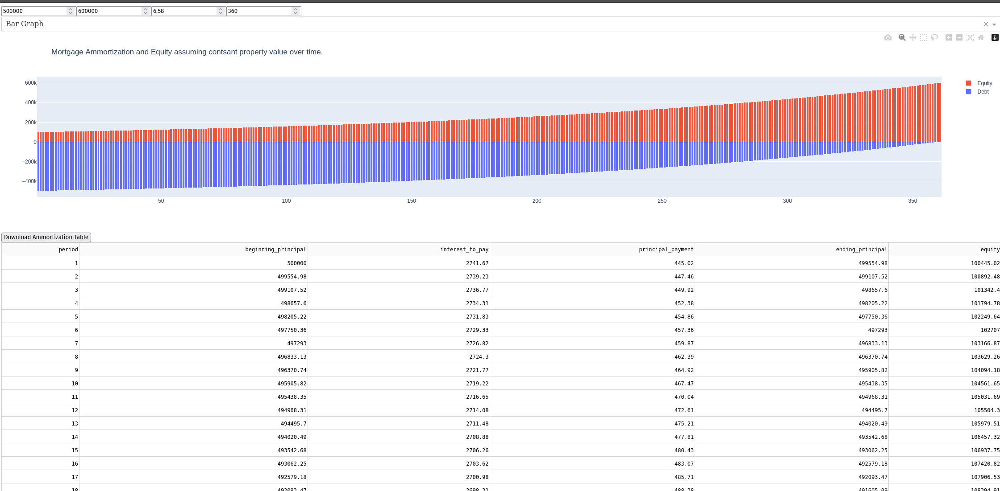

This is a bare bones project for a web app that helps users buy a home. It will calculate mortgage payments, have an ammoritzation table and graph, and show simulated home values.

To run, you will need an api key from St. Louis FRED, an account will need to be made for an api key.

1. Sign up at: https://fred.stlouisfed.org/
2. After sign up an API key can be gotten at: https://fredaccount.stlouisfed.org/apikeys
3. Set the your api key as an enviroment variable `FRED_API = "YOUR_KEY_HERE"`

Run any of the dashapp_*.py files.

dashapp_mortgage_ammortization.py will take user inputed data and a graph and a table of your expected ammortitzation schedule, the gradual paydown of your loan, will appear. User needs to input a loan amount, home value, annual percentage rate (APR, this is just the quoted interest rate), and term in months. Term in months is defaluted to be 360 months, equalivant to a 30 year mortgage. APR is automatically populated by taking the most recent average 30 year mortgage rate from FRED.

dashapp_monte_carlo_property_value.py will take user inputed data and make an readable graph of the expected property value using a monte carlo simulation of a price index. User will be able to pick out an index from FRED or upload their own. The graph will be replaced with less runs and a summary table.